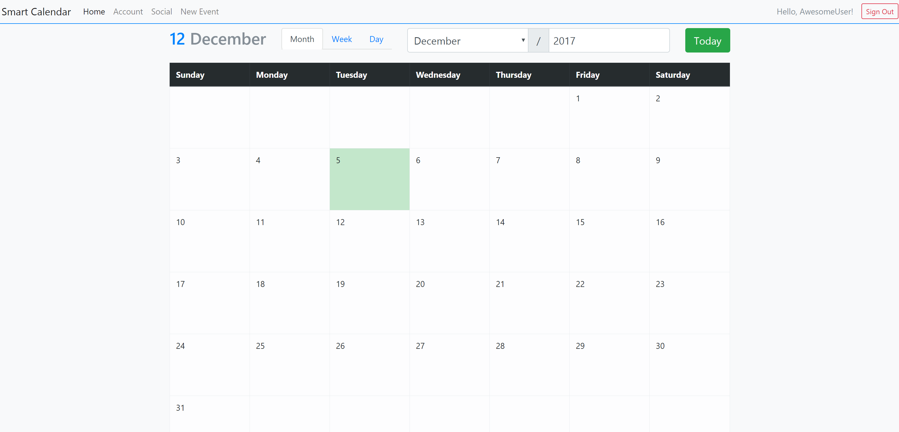
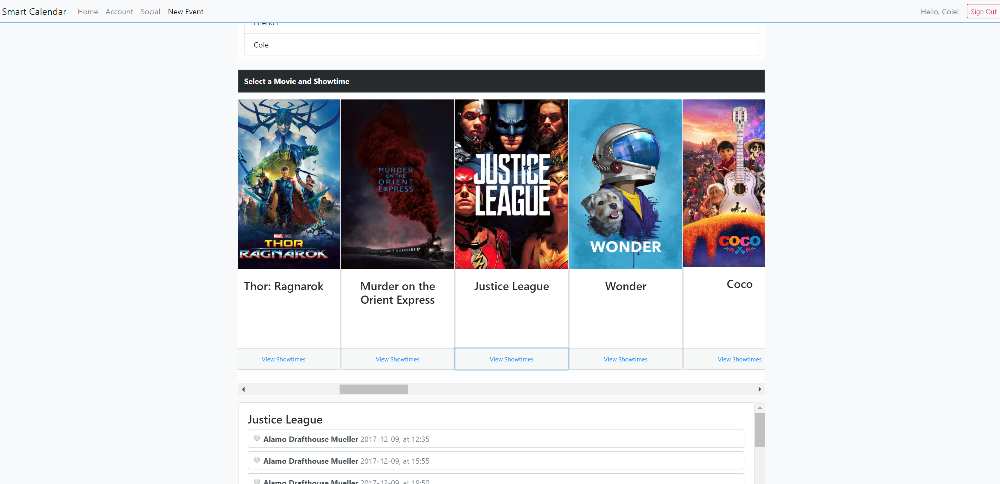
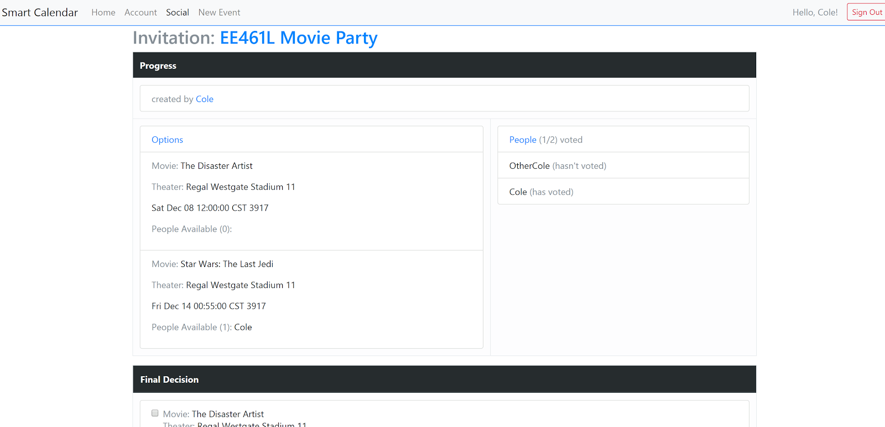
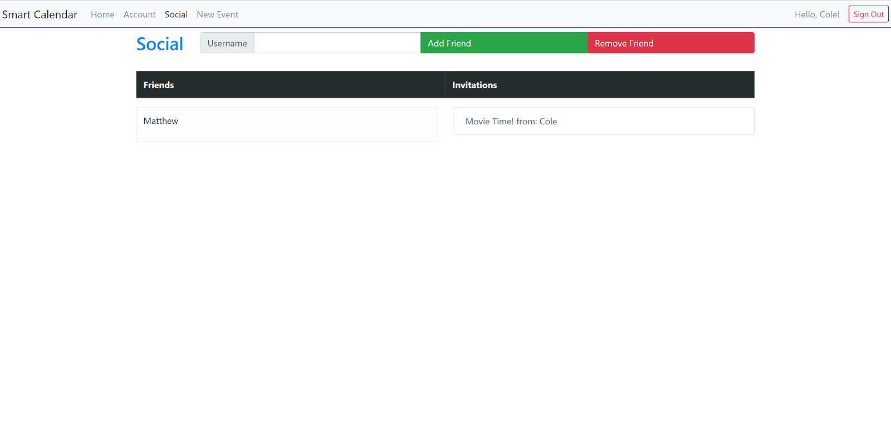

# Smart Calendar EE461L
Project for Software Design Lab (EE461L) at the University of Texas at Austin. Smart Calendar and Scheduler

## About
The purpose of this calendar is to make it easy to create event invitations that have multiple options. When planning an event with many people, everyone tends to have a different opinion. This scheduler allows users to vote on options before finalizing an event. Movie events are also supported, which allow you to search for movies and select showtimes during event creation.

## How to set up in Eclipse
Clone github repo and open Eclipse. File>New>Google App Engine project. Select the SmartCalendar folder as the project directory. Make sure to add objectify library, and java 8.

## Movies
Movie data is gathered from the Gracenote API

